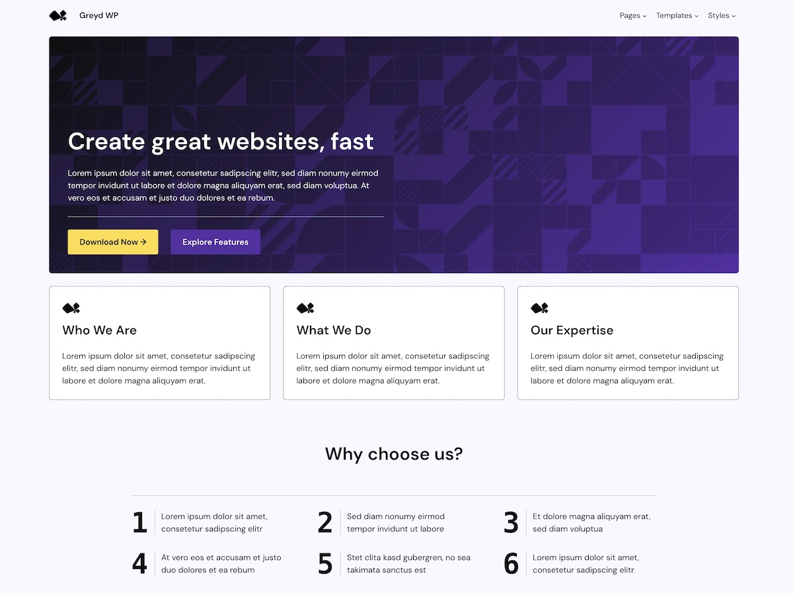

# Greyd Theme

The Greyd Theme is a multipurpose WordPress theme designed to give you more options and flexibility in the context of Full Site Editing. The block theme offers **additional Global Styles** to cover all your needs that might not be covered by the core offering yet. These features include various global button styles, hover effects for buttons, fluid font sizes and more. The global spacing presets can easily be individualized to your likings. The Greyd Theme is **accessibility-ready and responsive**, as it automatically adapts to the screen size without you having to individually define layouts and sizes for each breakpoint. Just like you know it from intrinsic web design.

The Greyd theme is **designed to fast and flexibly fit any WordPress website**. It additionally comes with a variety of **patterns and templates** that are suitable for any kind of website and landing page. For an even easier visualization and customization all design adjustments are displayed in the preview with our handy **set-up pattern**. All these features let you do the work of professional developers without having profound knowledge.

## Getting started

| Link | Description |
| ------------- | ------------- |
| [Features and tutorial](https://greyd.io/greyd-theme/) | Learn more about the features of the Theme and how to use it. |
| [Live Demo](https://theme.greyd.io/) | View a live demo including all the styles, pages and templates. |
| [Download the theme](https://wordpress.org/themes/greyd-wp/) | Download the latest theme zip to install on your WordPress site. |
| [GitHub](https://github.com/Greyd-Suite/greyd-wp) | Dig through the source code in the official GitHub Repository. |
| [Discover Greyd.Suite](https://greyd.io/demo/) | Learn more about what Greyd.Suite has to offer. |

## Installation

Before you start, make sure you're running WordPress 6.4 or later.

1. Start by [downloading the theme](https://wordpress.org/themes/greyd-wp/).
2. Go to `Appearance → Themes → Add New`
3. Upload the ZIP.
4. Activate the theme.

## Copyright

Greyd WP, (C) 2024 Greyd GmbH.
The Greyd WP theme is distributed under the terms of the [GNU GPLv2 or later](http://www.gnu.org/licenses/gpl-2.0.html)

This program is free software: you can redistribute it and/or modify
it under the terms of the GNU General Public License as published by
the Free Software Foundation, either version 2 of the License, or
(at your option) any later version.

This program is distributed in the hope that it will be useful,
but WITHOUT ANY WARRANTY; without even the implied warranty of
MERCHANTABILITY or FITNESS FOR A PARTICULAR PURPOSE. See the
GNU General Public License for more details.

## Images

All images used in this theme have been created by our team or generated with the assistance of tools such as [Midjourney](https://www.midjourney.com/home) and [PatternPad](https://patternpad.com/).
As such, we hold full ownership and rights to these images.
You are free to use them within the context of this theme in accordance with the theme's license agreement.
If you have any questions regarding the usage or licensing of these images, please contact us.

* [Midyourney Terms of service](https://docs.midjourney.com/docs/terms-of-service)
* [PatternPad Terms of service](https://patternpad.com/terms.html)

## Contributors

* [greydsuite](https://profiles.wordpress.org/greydsuite/)
* [annebovelett](https://profiles.wordpress.org/annebovelett/)
* [luminuu](https://profiles.wordpress.org/luminuu/)
* [sandrakurze](https://profiles.wordpress.org/sandrakurze/)
* [jtgreyd](https://profiles.wordpress.org/jtgreyd/)
* [thomask42](https://profiles.wordpress.org/thomask42/)
